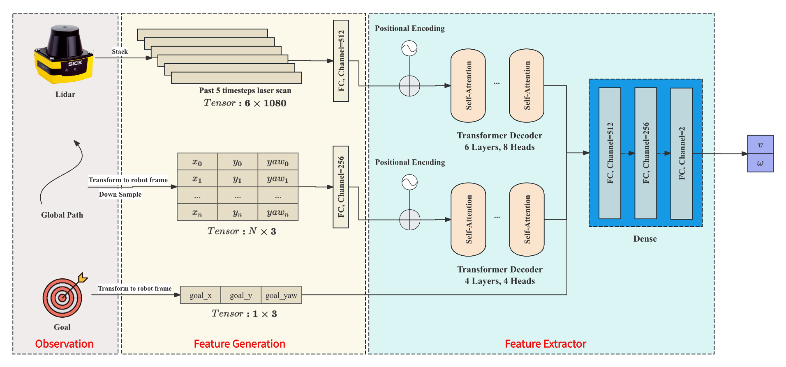
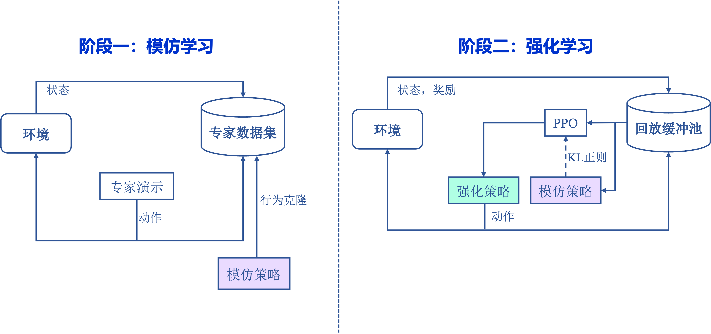
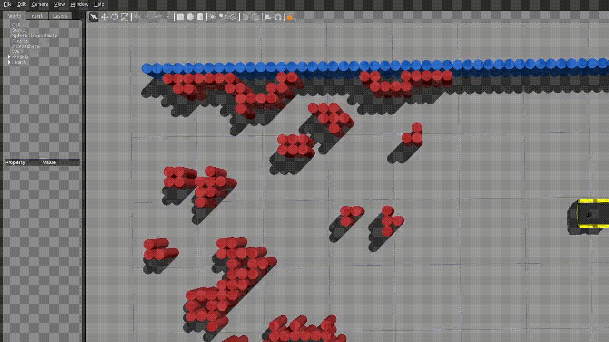

# Deep Learning Planner

## Install

```shell
git clone https://github.com/llliuxiao/isaac_sim.git
```

## Dependency

- python
- isaac sim
- ros1
- stable-baseline3
- pytorch
- gymnasium
- einops
- argparse
- beartype
- isaac_sim

## Structure





## Video Demo




## Usage

#### imitation learning training

```shell
python scripts/transformer_train.py
```

#### deep reinforcement learning training

```shell
roslaunch isaac_sim simple_navigation map:=$scene

$ISAAC_SIM_PYTHON scripts/drl_train.py --scene $scene
```

#### real-robot-deploy

the imitation mode or reinforcement mode could be adjusted with shell args, sim or real robot as well

```
python scripts/deploy/transformer_planner.py
```

if deploy to agv234,  mapping lidar point cloud from high resolution to low resolution in the simulator is necessary

```
python scripts/real_robot/transfer_lidar.py
```

#### evaluation

not totally implemented yet, only a basic framework without fully test

## Reference

- DRL-VO
- RT1
- From Perception to Decision: A Data-driven Approach to End-to-endMotion Planning for Autonomous Ground Robots